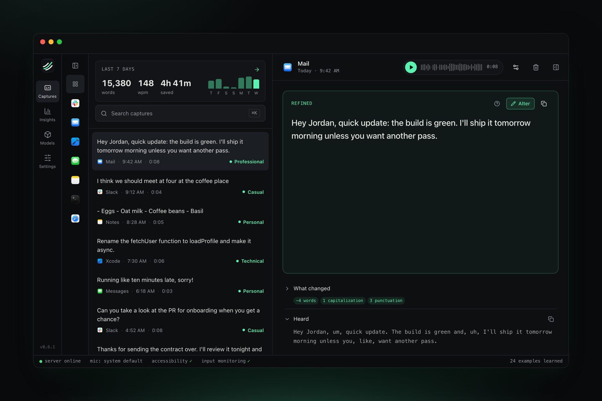
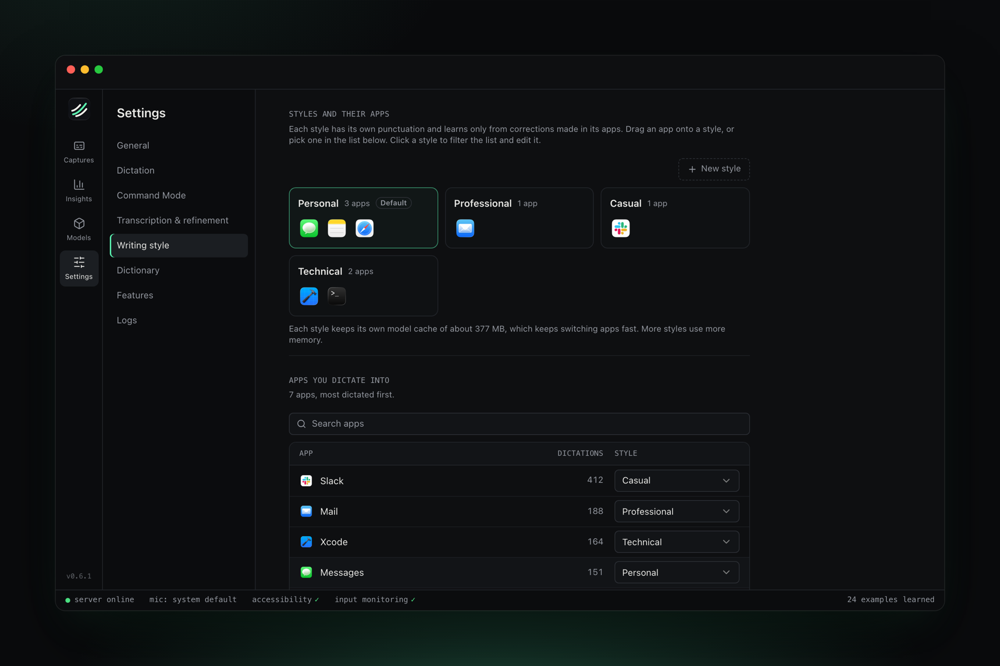
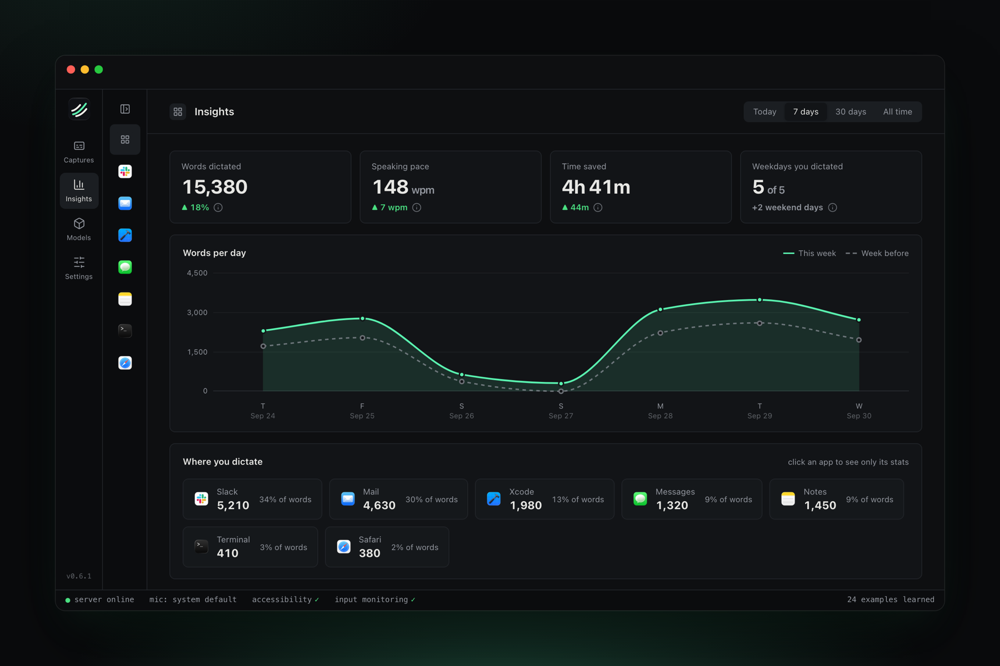

<p align="center">
  
</p>

<h1 align="center">Herga</h1>

<p align="center">
  <strong>Private dictation for your Mac.</strong><br/>
  Hold a key, speak, and let go. Herga turns what you said into clean, ready-to-send text in any app.<br/>
  Everything runs on your Mac.
</p>

<p align="center">
  <a href="https://herga.mrgnhnt.com">Website</a> ·
  <a href="https://github.com/mrgnhnt96/herga/releases/latest">Download</a> ·
  <a href="https://herga.mrgnhnt.com/docs/">Docs</a> ·
  <a href="https://herga.mrgnhnt.com/changelog/">Changelog</a>
</p>

<p align="center">
  
</p>

## How it works

Hold the chord in any app and talk the way you think. Whisper transcribes while you speak, and a local LLM drops the ums, applies your "no, actually"s and pastes the result into the field you started in. It never summarizes or adds words you didn't say.

## Features

- **Writing styles.** Each app gets its own style that learns how you write.
- **Dictionary.** Names and jargon, spelled the way you want.
- **Command Mode.** Select text anywhere and say how to rewrite it.
- **Correction learning.** Fix a result once and Herga learns from it.
- **Captures.** Every take is kept with its audio, so you can replay, re-transcribe or fix it.
- **Private.** No account, no server, no analytics. Audio and models stay on your Mac.

<p align="center">
  
</p>

<p align="center">
  
</p>

## Install

Requires an Apple Silicon Mac. Download the latest DMG from [Releases](https://github.com/mrgnhnt96/herga/releases/latest). Herga updates itself in the background.

## Development

Built with Tauri (Rust), React and a bundled FastAPI server running Whisper and Qwen3 on MLX.

```bash
brew install just
just setup     # Python venv and dependencies
just dev       # backend + desktop app
just check     # lint, format and typecheck
just test      # backend tests
just install   # build and install to /Applications
```

You'll need [Bun](https://bun.sh), [Rust](https://rustup.rs), [Python 3.12](https://python.org), Xcode and the [Tauri prerequisites](https://v2.tauri.app/start/prerequisites/). See [Build from source](https://herga.mrgnhnt.com/docs/build-from-source/) for signing and details.

To release, move the Unreleased notes in [CHANGELOG.md](CHANGELOG.md) under the new version, commit, and run `./scripts/release.sh <version>` from a clean `main`.

To try a feature before it's public, run `./scripts/release.sh 0.7.0-beta.1` from any clean branch. Betas are published as prereleases: the website and the public update skip them, and only copies with **Settings › General › Beta updates** on install them. Betas keep their notes under Unreleased until the public release.

| Path       | What                                               |
| ---------- | -------------------------------------------------- |
| `app/`     | React frontend                                     |
| `tauri/`   | Desktop shell and native dictation code (Rust)     |
| `backend/` | Python server: STT, refinement, captures, learning |
| `site/`    | Website, docs and changelog                        |

## License

MIT. Herga started as a fork of [Voicebox](https://github.com/jamiepine/voicebox) by Jamie Pine. The name comes from *jerga*, Spanish for slang.
